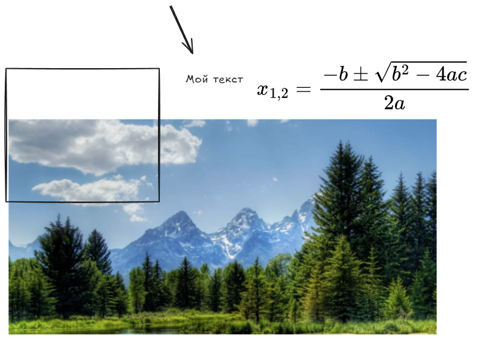
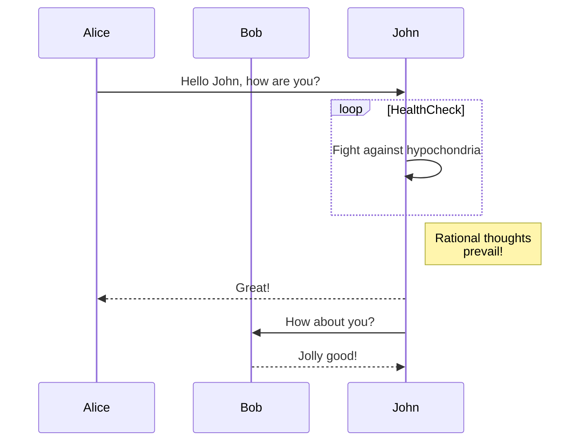
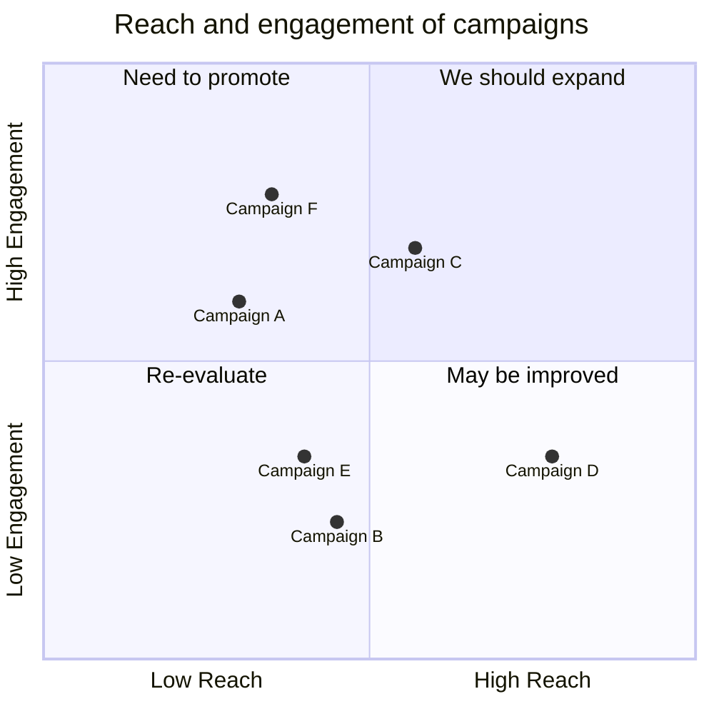

---
Author:
  - Ширяев Антон
tags:
  - obsidian
date: 2024-12-11
---
# Тест возможностей obsidain

## Базовые возможности

* список
* список
* список

1. список
2. список
3. список

Текст с кодом `print(python)` и математикой в виде LaTex $x_{1,2}=12$ 

$$x_{1,2}=\frac{-b\pm\sqrt{\color{Red}b^2-4ac}}{2a}$$

Код на Python:
```python
print('Hello, world')
```

Картинка:


Внутренняя ссылка ([ссылка](link_example.md)).

## ExaliDraw

* [ ] локальный



* [ ] онлайн

## Mermaid диаграммы

Пример [ссылки](https://mermaid.js.org/intro/)






