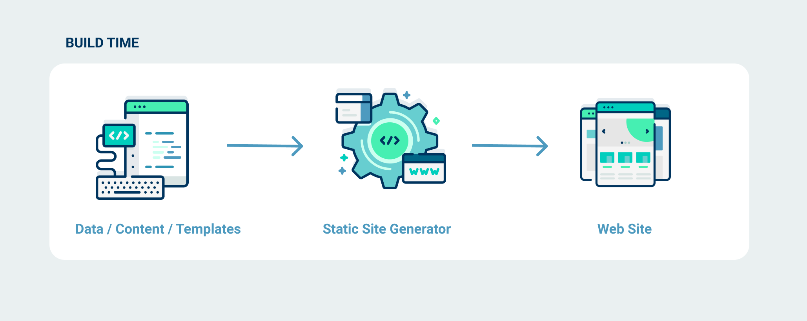

---
Author:
  - Ширяев Антон
tags:
  - obsidian
  - github
  - sphinx
  - мастер-класс
date: 2024-12-11
---


# Начинаем мастер класс

Перейдем в подготовленный репозиторий [ссылка](https://github.com/medphisiker/template_obisdian) 

* [ ] Создали новый репозиторий из шаблона.
* [ ] test_your_might.md
* [ ] push на github, показываем как все круто
* [ ] показываем проект по мультимодальным моделям Демо совместной работы
* [ ] рассказываем про генерацию статического сайта



Вот сравнение трех популярных генераторов статических сайтов из Markdown файлов:
* Hugo
* Sphinx
* MkDocs

---

| Характеристика                                        | **Hugo**                                              | **Sphinx**                                                                   | **MkDocs**                                                                                                                  |
| ----------------------------------------------------- | ----------------------------------------------------- | ---------------------------------------------------------------------------- | --------------------------------------------------------------------------------------------------------------------------- |
| **Сайт пример**                                       | [сайт пример](https://kubernetes.io/community/)       | [сайт пример](https://docs.python.org/3/)                                    | [сайт пример](https://docs.prefect.io/v3/get-started/index)                                                                 |
| **Язык**                                              | Go                                                    | Python                                                                       | Python                                                                                                                      |
| **Скорость сборки**                                   | Очень быстрый                                         | Средняя                                                                      | Медленнее по сравнению с Hugo                                                                                               |
| **Поддержка Markdown**                                | Да (с использованием плагинов)                        | Да (через MyST-Parser)                                                       | Да (нативный синтаксис)                                                                                                     |
| **Темы**                                              | Большой выбор тем [ссылка](https://themes.gohugo.io/) | Большой одинаковых тем [ссылка](https://sphinx-themes.org/)<br>Read the docs | Ограниченный выбор тем [ссылка](https://www.mkdocs.org/)<br>Material [ссылка](https://squidfunk.github.io/mkdocs-material/) |
| **Расширяемость**                                     | Высокая (плагины, шаблоны Go)                         | Высокая (плагины, расширения Python)                                         | Средняя (плагины Python)                                                                                                    |
| **Простота использования**                            | Простой для базовых сайтов                            | Сложнее (MyST)                                                               | Очень простой                                                                                                               |
| **Целевая аудитория**                                 | Разработчики, блоги, документация                     | Разработчики, документация, научные проекты                                  | Документация, простые сайты                                                                                                 |
| **Поддержка LaTeX**                                   | Нет (нужно использовать внешние инструменты)          | Да (через LaTeX)                                                             | Нет (нужно использовать внешние инструменты)                                                                                |
| **Многоязычность c переключением языка в интерфейсе** | Да                                                    | Да, [сайт пример](https://docs.python.org/3/)                                | нет [ссылка](https://squidfunk.github.io/mkdocs-material/blog/2024/08/19/how-were-transforming-material-for-mkdocs/)        |
| **Контроль версий**                                   | Да                                                    | Да (через sphinx-multiversion)                                               | Нет                                                                                                                         |
| **Интеграция с CI/CD**                                | Да                                                    | Да                                                                           | Да                                                                                                                          |
| **Поддержка GitHub Pages**                            | Да                                                    | Да                                                                           | Да                                                                                                                          |
| **Поддержка PDF**                                     | Нет (нужно использовать внешние инструменты)          | Да (через LaTeX, можно еще и генерить pdf на разных языках)                  | Да (есть стандартный плагин [ссылка](https://habr.com/ru/companies/rostelecom/articles/570098/))                            |
| **Поддержка формул LaTeX**                            | Да                                                    | Да (через MyST-Parser)                                                       | ?                                                                                                                           |
| **Поддержка сложных сайтов**                          | Да (подходит для блогов, сайтов)                      | Да (подходит для научных проектов)                                           | Ограниченная (лучше для документации)                                                                                       |
| **Поддержка тегов и категорий**                       | Да                                                    | Да (через расширения)                                                        | Ограниченная                                                                                                                |
| **Поддержка автоматической документации**             | Да (через плагины)                                    | Да (через autodoc)                                                           | Ограниченная                                                                                                                |
| **Поддержка интерактивной документации**              | Да (через плагины)                                    | Да (через Breathe, Doxygen)                                                  | Ограниченная                                                                                                                |

---

# Генерируем статичный сайт на Sphinx
---
## Установка Sphinx

1. Устанавливаем Sphinx:
   Убедитесь, что у вас установлен Python, затем установите Sphinx через pip:
   ```bash
   pip install sphinx
   ```

2. Создаем проект Sphinx:
   Перейдите в корневую папку вашего репозитория и выполните команду:
   ```bash
   sphinx-quickstart
   ```
   Следуйте инструкциям, чтобы настроить базовый проект Sphinx.

3. Настройка Sphinx для работы с Markdown

По умолчанию Sphinx использует reStructuredText (reST), но вы можете настроить его для работы с Markdown с помощью расширения **MyST-Parser**.

Установим MyST-Parser**:
   ```bash
   pip install myst-parser
   ```

Включаем MyST-Parser в `conf.py`**:

   Откройте файл `conf.py` и добавьте `myst_parser` в список расширений:
   ```python
   extensions = [
       'myst_parser',
   ]
   ```

 Настраиваем поддержку Markdown:
   В файле `conf.py` добавьте следующие строки:
   ```python
source_suffix = {
   '.rst': 'restructuredtext',
   '.md': 'markdown',
}
   ```

4. **Темы**:
  Будем использовать тему для Sphinx, например, `sphinx_rtd_theme`:
  ```bash
  pip install sphinx_rtd_theme
  ```
  Затем добавьте тему в `conf.py`:
  ```python
  html_theme = 'sphinx_rtd_theme'
  ```

- **Многоязычность**:
  Если вам нужно поддерживать несколько языков, Sphinx поддерживает многоязычность. Вы можете настроить язык в `conf.py`:
  ```python
  language = 'ru'
  ```

## Перенос файлов из Obsidian в Sphinx

1. **Создайте папку для документации**:
   Поместите ваши Markdown файлы из Obsidian в папку `source` вашего проекта Sphinx. Например:
   ```
   source/
   ├── index.md
   ├── about.md
   └── subfolder/
       └── another.md
   ```

2. **Создайте индексный файл**:
   В папке `source` создайте файл `index.rst` (или `index.md`), который будет служить главной страницей. Например:
## Генерация статического сайта

1. **Сгенерируйте HTML**:
   Выполните команду для генерации статического сайта:
   ```bash
   sphinx-build -b html source _build/html
   ```

2. **Проверьте сайт**:
   Перейдите в папку `_build/html` и откройте файл `index.html` в браузере, чтобы увидеть ваш сайт.

## Дополнительные настройки

### Рендеринг формул Latex

```
myst_enable_extensions = [
    "dollarmath",  # Включает поддержку формул в двух долларах
]

mathjax_path = "https://cdn.jsdelivr.net/npm/mathjax@3/es5/tex-mml-chtml.js"
```

### Рендеринг Mermaid диаграмм

1. Устанавливаем расширение через pip:
   ```bash
   pip install sphinxcontrib-mermaid
   ```

2. Настройка Sphinx

Откройте файл `conf.py` в вашем проекте Sphinx.

Добавьте `sphinxcontrib.mermaid` в список расширений:
```python
extensions = [
   'sphinxcontrib.mermaid',
]
```

3. Настройте параметры Mermaid (опционально):
   Вы можете настроить параметры, такие как URL для загрузки библиотеки Mermaid или другие настройки. Например:
```python
mermaid_params = [
   '--theme', 'forest',  # Устанавливает тему для диаграмм
   '--width', '100%',    # Устанавливает ширину диаграмм
]
```

---

### Использование Mermaid диаграмм

Теперь вы можете встраивать диаграммы Mermaid в ваши документы. Для этого используйте директиву `mermaid`.

#### Пример использования в Markdown (с MyST-Parser):
Если вы используете Markdown, включите поддержку MyST-Parser:
```python
extensions = [
    'myst_parser',
    'sphinxcontrib.mermaid',
]
```

Затем используйте синтаксис MyST для встраивания диаграмм:

